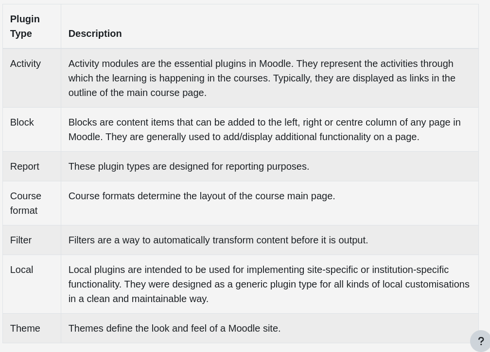
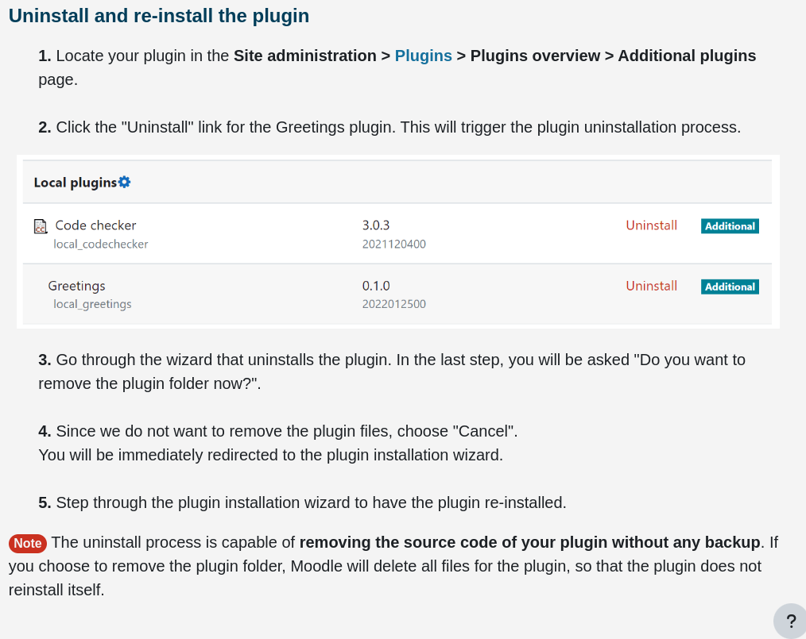
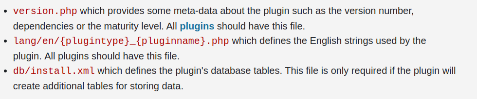

Mysql get-started: https://ubuntu.com/server/docs/databases-mysql

nginx get-started: https://ubuntu.com/tutorials/install-and-configure-nginx#2-installing-nginx

setting-up vscode for php developement for moodle: https://docs.moodle.org/dev/Setting_up_VSCode

mysql -u moodleuser -p
password: a

Apache restar: sudo service apache2 start/stop

Moodle server is located in the Xampp webroot: /var/www/html/

VSCode setup for Moodle Dev: https://docs.moodle.org/dev/Setting_up_VSCode

# Moodle plugin types:

# Reinstall a plugin

# Files in a plugin

# Moodle Database

select table containing questions SELECT questiontext FROM mdl_question;
